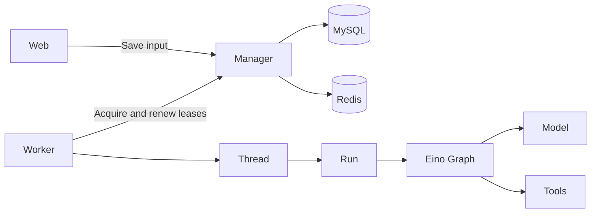

# DeepAgent

English · [简体中文](README.md)

**A coding companion in a pixel office.** Use natural language to explore code, edit files, run commands, and review progress and results. Built with Go and Eino Graph, with local and Docker filesystems.


*Product prototype: follow progress on the task board, work with your companion, and find results in the cabinet.*

[Quick start](#quick-start) · [Architecture](#architecture) · [Development guide](docs/development.md)

## Features

- **Pixel office**: Chinese and English UI, with conversation, plans, tools, changed files, and parent/child tasks.
- **Coding tools**: file operations, search, patches, commands, and background shell jobs. Local and Docker environments share the same tools.
- **Ongoing conversations**: streaming responses, additional input during execution, persistent history, and context compaction.
- **Approval and resume**: resume interrupted execution from a checkpoint. “Always allow” applies only to the authorized tool within the current task.
- **Extensions**: Skills, MCP, web search, subagent collaboration, and optional long-term memory.
- **Computer use**: browser and Mac app operations with screenshots and tool approval.

## Quick start

You need **Go 1.25+**, MySQL 8, Redis 7, and a model that supports tool calling and streaming. The example below uses Docker Compose to start the databases.

### 1. Clone and start storage

```bash
git clone https://github.com/doinglaundry/deepagent.git
cd deepagent

export DEEPAGENT_DB_PASSWORD='change_this_dev_password'
export DEEPAGENT_DB_ROOT_PASSWORD='change_this_root_password'
docker compose up -d --wait
```

If MySQL and Redis are already running, configure their connection details directly.

### 2. Configure a model

```bash
cp yaml/deepagent.example.yaml yaml/deepagent.yaml

export DEEPAGENT_MYSQL_DSN="deepagent:${DEEPAGENT_DB_PASSWORD}@tcp(127.0.0.1:3306)/deepagent?parseTime=true"
export DEEPAGENT_MODEL='YOUR_MODEL_ID'
export DEEPAGENT_MODEL_BASE_URL='https://YOUR_PROVIDER/v1'
export DEEPAGENT_MODEL_API_KEY='YOUR_API_KEY'
```

The example uses an OpenAI-compatible API. The local configuration file is ignored by Git. See the [configuration example](yaml/deepagent.example.yaml) for all fields.

### 3. Start Worker and Web

Set the environment variables above in both terminals, then run these commands from the repository root:

```bash
# Terminal 1
go run ./cmd/deepagent_worker --config yaml/deepagent.yaml
```

```bash
# Terminal 2
go run ./cmd/deepagent_web --config yaml/deepagent.yaml --root . --addr 127.0.0.1:8080
```

Open [127.0.0.1:8080](http://127.0.0.1:8080) and try: **“Read README.en.md and explain this project's execution flow.”**

`--root` sets the agent's working directory. Web and Worker must connect to the same MySQL and Redis instances. Both processes must be running to execute tasks.

## Architecture



| Component | Responsibility |
| --- | --- |
| Manager | Persistence, scheduling eligibility, leases, input, and output; embedded in the Web and Worker processes |
| Worker | Acquire Threads, deliver messages, save output, and release leases |
| Thread | Conversation history, pending input, the current Run, and resource lifetimes |
| Run | Identity, cancellation, and completion of one execution |
| Graph | Model/tool flow, approval interrupts, and checkpoint recovery |

A Thread can execute multiple Runs in sequence, with one active at a time. Approval pauses save progress; resuming preserves the original RunID. Parent and child agents use the same Graph implementation.

## Optional: browser and Mac operations

Computer use is disabled by default. Set `computer_enabled: true` in your local YAML, configure `browser_origins` and `computer_apps`, and build the native helper:

```bash
sh scripts/build-computer.sh
.eino-cli/bin/deepagent-computer --request-permissions
.eino-cli/bin/deepagent-worker --config yaml/deepagent.yaml
```

This requires macOS, Chrome, Swift build tools, and Accessibility and Screen Recording permissions. Visual tasks require a model that supports images and tool calling. When enabled, start Worker using the binary shown above.

## Development

```bash
go build ./...
go test -race ./...
node --test deepagent/host/web/app.test.cjs
```

The [development guide](docs/development.md) (Chinese) covers the architecture, tools, configuration, source navigation, distributed validation, and troubleshooting.
