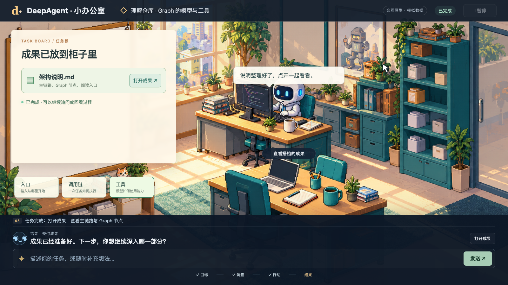
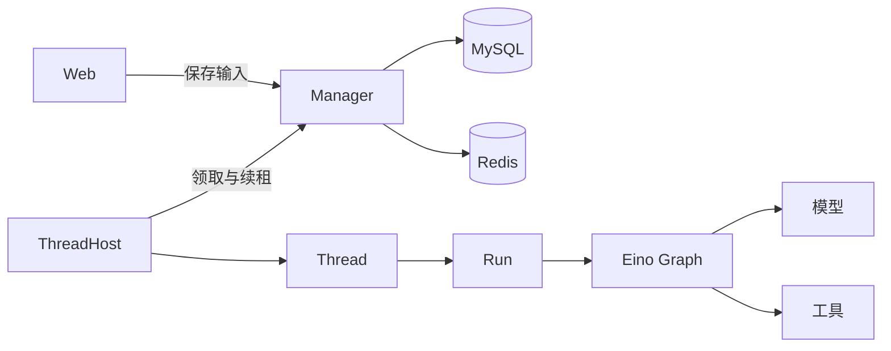

# DeepAgent

**一个住在像素办公室里的编码搭档。** 用自然语言读代码、改文件、运行命令，并查看执行过程和成果。基于 Go 与 Eino Graph，支持本地和 Docker 文件系统。



*像素办公室产品原型：任务板展示进度，搭档执行任务，成果柜收纳产出。*

[快速开始](#快速开始) · [架构](#架构) · [开发文档](docs/development.md)

## 功能

- **像素办公室**：中英切换，查看对话、计划、工具、修改文件及主任务／子任务。
- **编码工具**：文件读写、搜索、补丁、命令与后台 Shell；本地和 Docker 共用一组工具。
- **持续对话**：流式输出、追加输入、历史持久化和上下文压缩。
- **审批与续跑**：暂停后从 checkpoint 恢复；“始终允许”只记住当前任务中已授权的工具。
- **扩展能力**：Skills、MCP、网页搜索、子代理协作和可选长期记忆。
- **Computer Use**：浏览器与 Mac 应用操作，返回截图，动作沿用工具审批。

## 快速开始

需要 **Go 1.25+**、MySQL 8、Redis 7，以及支持工具调用和流式输出的模型。下例通过 Docker Compose 启动数据库。

### 1. 获取项目并启动存储

```bash
git clone https://github.com/doinglaundry/deepagent.git
cd deepagent

export DEEPAGENT_DB_PASSWORD='change_this_dev_password'
export DEEPAGENT_DB_ROOT_PASSWORD='change_this_root_password'
docker compose up -d --wait
```

已有 MySQL／Redis 时，直接在配置中填写实际连接信息。

### 2. 配置模型

```bash
cp yaml/deepagent.example.yaml yaml/deepagent.yaml

export DEEPAGENT_MYSQL_DSN="deepagent:${DEEPAGENT_DB_PASSWORD}@tcp(127.0.0.1:3306)/deepagent?parseTime=true"
export DEEPAGENT_MODEL='YOUR_MODEL_ID'
export DEEPAGENT_MODEL_BASE_URL='https://YOUR_PROVIDER/v1'
export DEEPAGENT_MODEL_API_KEY='YOUR_API_KEY'
```

示例使用 OpenAI 兼容接口。本地配置已被 Git 忽略；完整字段见 [配置示例](yaml/deepagent.example.yaml)。

### 3. 启动 Worker 和 Web

两个终端都设置上面的环境变量，再在仓库根目录执行：

```bash
# 终端 1
go run ./cmd/deepagent_worker --config yaml/deepagent.yaml
```

```bash
# 终端 2
go run ./cmd/deepagent_web --config yaml/deepagent.yaml --root . --addr 127.0.0.1:8080
```

打开 [127.0.0.1:8080](http://127.0.0.1:8080)，试试：**“读取 README.md，解释这个项目的执行链路。”**

`--root` 是 Agent 的工作目录。Web 和 Worker 连接同一组 MySQL／Redis；需要同时运行两个进程才能执行任务。

## 架构



| 对象 | 职责 |
| --- | --- |
| Manager | 持久化、调度资格、租约、输入与输出；嵌入 Web／Worker 进程 |
| ThreadHost | 领取 Thread、投递消息、保存输出与释放租约 |
| Thread | 对话历史、待处理输入、当前 Run 和资源生命周期 |
| Run | 一次执行的身份、取消与完成 |
| Graph | 模型／工具流程、审批中断与 checkpoint 恢复 |

一个 Thread 可以先后执行多个 Run，同一时刻执行一个。审批暂停保存执行进度，恢复沿用原 RunID。模型与子代理复用同一套 Graph。

## 可选：浏览器与 Mac 操作

默认关闭。在本地 YAML 中设置 `computer_enabled: true`，填写 `browser_origins` 和 `computer_apps`，再构建原生辅助程序：

```bash
sh scripts/build-computer.sh
.eino-cli/bin/deepagent-computer --request-permissions
.eino-cli/bin/deepagent-worker --config yaml/deepagent.yaml
```

需要 macOS、Chrome、Swift 编译工具，以及辅助功能和屏幕录制权限。视觉任务需要支持图片与工具调用的模型。启用后用上面的二进制启动 Worker。

## 开发

```bash
go build ./...
go test -race ./...
node --test deepagent/host/web/app.test.cjs
```

[开发文档](docs/development.md)包含详细架构、工具、配置、源码导航、分布式验收和常见问题。
