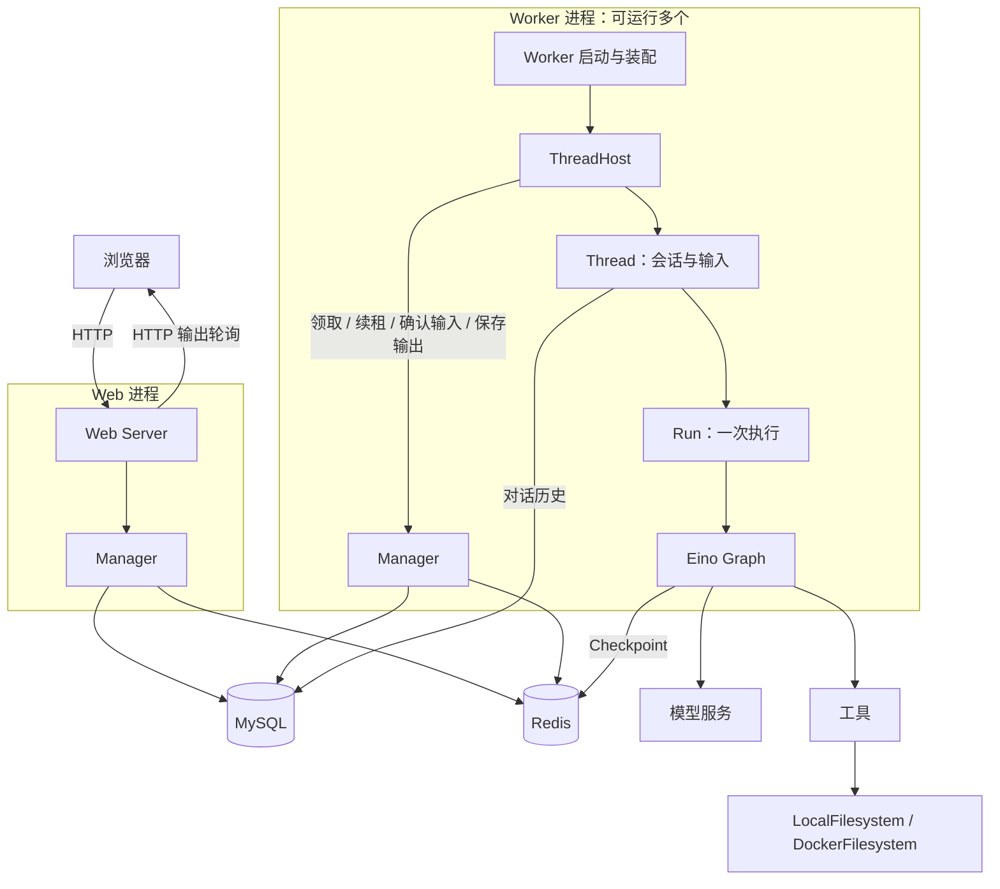
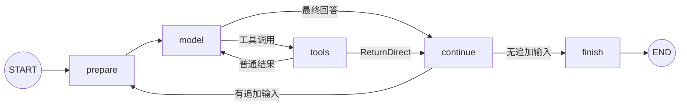

# DeepAgent

**基于 Go 和 Eino Graph 的编码 Agent，通过 Web 对话，在本地或 Docker 环境中执行工具。**

Web 负责交互，Worker 负责执行，Manager 通过 MySQL 与 Redis 协调任务。一条 Eino Graph 串起模型、工具、追加输入和中断恢复。

[快速开始](#快速开始) · [架构](#架构) · [工具](#工具) · [配置](#配置) · [阅读代码](#阅读代码) · [开发与验证](#开发与验证)

## 能做什么

- **Web 对话**：流式回答、历史消息、工具输出、审批与恢复。
- **代码操作**：读取、搜索、编辑文件，应用补丁，执行命令和后台 Shell 任务。
- **两种执行环境**：同一组文件和命令工具，接入 `LocalFilesystem` 或 `DockerFilesystem`。
- **连续执行**：运行中追加输入，管理对话历史、上下文压缩和 token usage。
- **中断恢复**：借助 Eino checkpoint 保存执行位置，审批后继续。
- **扩展能力**：Skills、MCP、网页读取与搜索、长期记忆。
- **任务协作**：同一 Graph 执行内部子代理；Manager 调度独立 Thread。

## 快速开始

### 1. 准备环境

| 依赖 | 用途 |
| --- | --- |
| Go 1.25+ | 构建 Web 和 Worker；版本要求见 [go.mod](go.mod) |
| MySQL 8 | Thread、输入投递、Run 结果和对话历史 |
| Redis 7 | 共享 ID、实时事件、checkpoint |
| 支持工具调用与流式输出的模型 | Agent 推理与工具选择 |
| Docker Compose | 可选，用于启动本地 MySQL / Redis |

当前 Worker 的执行环境代码面向 macOS / Linux。Windows 建议在 Linux 环境中运行。

以下命令在仓库根目录执行。

### 2. 启动 MySQL 和 Redis

已有服务可跳过此步，并在配置中填入实际连接信息。

```bash
export DEEPAGENT_DB_PASSWORD='change_this_dev_password'
export DEEPAGENT_DB_ROOT_PASSWORD='change_this_root_password'

docker compose up -d --wait
```

[compose.yaml](compose.yaml) 将 MySQL / Redis 分别绑定到本机 `3306` / `6379`，使用持久化数据卷。

### 3. 配置模型和数据库

```bash
cp yaml/deepagent.example.yaml yaml/deepagent.yaml

export DEEPAGENT_MYSQL_DSN="deepagent:${DEEPAGENT_DB_PASSWORD}@tcp(127.0.0.1:3306)/deepagent?parseTime=true"
export DEEPAGENT_MODEL='YOUR_MODEL_ID'
export DEEPAGENT_MODEL_BASE_URL='https://YOUR_PROVIDER/v1'
export DEEPAGENT_MODEL_API_KEY='YOUR_API_KEY'
```

示例使用 OpenAI 兼容接口。其他 provider 见下方[配置](#配置)。本地 `yaml/deepagent.yaml` 已被 Git 忽略。

### 4. 启动两个进程

在两个终端中使用相同的数据库环境变量；Worker 终端还需要模型环境变量。

```bash
# 终端 1：执行模型和工具
go run ./cmd/deepagent_worker --config yaml/deepagent.yaml
```

```bash
# 终端 2：Web 用户入口
go run ./cmd/deepagent_web \
  --config yaml/deepagent.yaml \
  --root . \
  --addr 127.0.0.1:8080
```

打开 **http://127.0.0.1:8080**，提交第一条消息：

> 列出当前工作目录的文件，读取 README.md，然后简要解释这个项目。

`--root` 指定 Agent 的工作目录。Web 和 Worker 必须连接同一组 Manager 存储；只启动 Web 时，消息会等待 Worker 领取。

## 架构

### 进程与调度



**Manager 是进程内模块，不是需要额外启动的第三个服务。** Web 提交后写入存储，ThreadHost 主动领取；两者不是同步调用模型的关系。

### 一条输入的执行路径

```text
Manager.Submit                     保存输入，标记可调度
    ↓ ThreadHost 调用 Acquire
ThreadHost                         获取租约，创建运行环境
    ↓
Thread.PostMessage                 解码 Input / Resume / Compact
    ↓
Thread.SubmitInput / ResumeRun      追加输入，或创建本次 Run
    ↓
Run.Execute                        模型、工具、取消、恢复与清理
    ↓
Eino Graph                         模型与工具循环
```

| 对象 | 管理什么 | 生命周期 |
| --- | --- | --- |
| Manager | Thread 调度、租约、输入投递、输出和 Run 结果 | 进程 |
| ThreadHost | 领取、续租、投递、保存输出和释放 | 进程 / 一次领取 |
| Thread | 历史、待处理输入、当前 Run、外部协议和环境清理 | 一次领取，可先后执行多个 Run |
| Run | 执行 ID、Graph、模型、工具、取消、恢复与完成 | 一次执行；恢复沿用原 RunID |

同一个 Thread 同时只执行一个 Run。输入归属与结束判断使用同一把锁；最后事件交付后才清除当前 Run，并让 Wait 返回。可变 middleware 每个 Run 独立创建。

Thread 直接拥有协议转换与执行生命周期；Run 直接拥有 Eino Runnable，不再经过独立的 DeepAgentThread、DeepAgent 或 filesystemThread 包装对象。内部子代理直接使用同一种 Run。

### Eino Graph



```text
prepare   输入入历史、按需压缩、构造 prompt
model     调用模型流、收集工具调用、记录 usage
tools     策略判断、审批、执行工具、按调用顺序写结果
continue  接收 pending input，或结束本次执行
finish    返回最终消息
```

`Conversation` 管历史、压缩和 usage；`ToolSet` 管工具定义；`ToolExecutor` 管实际执行。子代理也使用这套 Graph。

### 输出与恢复

```text
Graph 事件
    → Run 补充执行身份
    → Thread 转换外部协议
    → ThreadHost 调用 Manager.SaveOutput
    → Web 读取已持久化输出

工具需要审批
    → Eino Interrupt
    → 保存 Checkpoint
    → RunRecord 记录 blocked；Thread 仍为 open

用户回复审批
    → Manager.Resume
    → ThreadHost 领取
    → Thread.ResumeRun
    → 新 Run 对象沿用原执行身份，从 Graph 中断位置继续
```

ThreadHost 先处理输出保存，再处理 Yield 和租约释放。完整结果与流式增量的持久化策略不同，完整历史以存储中的消息为准。

### 状态与租约

```text
Thread:  open → closing → closed
Message: pending → accepted；执行前取消 → canceled
Run:     started → blocked → started → finished / interrupted / failed
```

- Thread 只保存生命周期、租约和 LastRunID；ready/running/blocked 是查询得到的展示状态。
- Message 的状态只表示输入投递；输出消息不设置投递状态。执行结果通过 RunID 查询 `agent_run`。
- 输入队列以 MySQL 为唯一来源。Submit、AckInput、SaveOutput、Resume 和 Close 使用同一 Thread 行锁。
- Acquire 根据待处理输入、恢复命令和未结束的 Run 领取租约；普通输入不会唤醒 blocked Run。
- ReleaseThread 只清除租约。恢复时按 MessageID 去重，保留 checkpoint 之外的新输入。
- 本次状态模型不提供旧邮箱数据迁移。已有旧状态数据应使用新的空邮箱数据库；不要直接将旧表状态改为 open，否则会丢失执行归属。

## 工具

工具是否对模型可见，取决于配置、只读限制和工具过滤。

| 类别 | 工具 | 实现位置 |
| --- | --- | --- |
| 文件读取 | `list_files`、`read_file` | `core/tools` → filesystem |
| 文件修改 | `write_file`、`edit_file`、`delete_file`、`apply_patch` | `core/tools` → filesystem |
| 搜索 | `glob`、`grep`、`rg`、`semantic_search` | 文件系统搜索与词项匹配 |
| 命令 | `execute`、`shell`、`await_shell`、`read_lints` | 本地或 Docker 命令服务 |
| 交互 | `ask_user`、`update_plan` | 中断问答 / Plan middleware |
| 技能 | `activate_skill` | Skill loader / middleware |
| 内部子代理 | `task` | ChildRunner → Run → Graph |
| 跨 Thread 协作 | `spawn_task`、`send_message`、`wait_message`、`close_task` | ThreadHost → Manager |
| 网络 | `read_url`、`web_search` | Web 配置启用 |
| MCP | 服务发现返回的工具 | MCP client → ToolSet |

`semantic_search` 当前按查询词在路径和代码行中的匹配程度排序，不依赖 embedding 或向量数据库。

```text
Model ToolCall
    → ToolSet 查找定义
    → Policy：allow / deny / ask_approval
    → ToolExecutor：并行、取消、执行记录
    → Eino Tool
    → ToolResult
```

内部 `task` 与跨 Thread 的 `spawn_task` 是两种不同的任务生命周期。跨 Thread 等待会占用执行名额，应为子任务预留 Worker 并发。

## 配置

完整起点：[yaml/deepagent.example.yaml](yaml/deepagent.example.yaml)。YAML 字符串支持 `${ENV_VAR}` 展开。

| 配置 | 用途 |
| --- | --- |
| `manager` | MySQL、Redis 连接信息 |
| `worker` | 并发、轮询、租约、续租和关闭超时 |
| `models` / `default_model` / `role_models` | 模型实例、默认模型和角色映射 |
| `filesystem_kind` | `local` 或 `docker` |
| `max_steps` / `max_model_calls` | Graph 与模型调用预算 |
| `context_window` / `compact_threshold_tokens` / `keep_recent_messages` | 上下文与压缩策略 |
| `skill_paths` | Skill 搜索目录 |
| `web` / `mcp` | 网络工具与 MCP 服务 |
| `memory_enabled` / `memory_dir` | 长期记忆开关与目录 |

### 模型

ModelHub 接受以下 `provider`：

- `openai` / `openai-compatible`
- `kimi` / `moonshot`
- `ark`

OpenAI 兼容服务通过 `model`、`base_url`、`api_key` 配置。具体模型需要支持本项目使用的流式输出和工具调用协议。

### Docker 文件系统

```yaml
filesystem_kind: docker
docker:
  image: "YOUR_AIO_SANDBOX_IMAGE"
  container_prefix: "deepagent-workspace"
```

需要可访问的 Docker 服务和提供 AIO 文件 API 的镜像，普通 Linux 镜像不能直接替代。默认 `local` 不需要 Docker 执行环境。

### Web、MCP、Skills 与记忆

```yaml
web:
  enabled: true
  search_url: "https://YOUR_SEARCH_SERVICE/search?q={query}"

mcp:
  - name: reference
    url: "https://YOUR_MCP_SERVER/mcp"
    headers:
      Authorization: "Bearer ${REFERENCE_MCP_TOKEN}"

skill_paths:
  - deepagent/skills

memory_enabled: true
memory_dir: .eino-cli/shared-memory
memory_lease_ttl: 30s
```

- Web 搜索需要配置搜索服务；页面读取与搜索使用各自的工具。
- MCP 当前连接 HTTP 服务；stdio 服务需要额外的 HTTP bridge。
- Skills 按需激活，内置技能资源位于 `deepagent/skills/public/`。
- 长期记忆在 Run 完成后提取和整理；模型执行仍复用 Run。作用域优先使用 `memory_user_id`，其次 UserID，再其次 SessionID。

### 存储与部署边界

| 数据 | 当前 Worker 使用的存储 |
| --- | --- |
| Thread 生命周期、租约、消息投递、Run 结果与历史 | MySQL |
| 共享 ID、实时事件、历史序号 | Redis |
| Eino checkpoint | Redis |
| 工作文件与记忆产物 | 本地 / 容器文件系统及配置的记忆目录 |

Core 另有文件 checkpoint 实现，但当前 Worker 没有通过 YAML 选择 checkpoint 后端的配置项。

- 示例压缩阈值是 `24000`，设为 `0` 不配置自动压缩；负数会被配置校验拒绝。
- 多机 Worker 需要能访问 Thread 对应的工作路径；共享数据库不会同步工作文件。
- 本地 Shell 以 Worker 进程权限运行。文件路径约束不等同于操作系统隔离。
- 租约过期后可由其他 Worker 接管；checkpoint 和执行记录不构成外部副作用的全局 exactly-once 保证。

## 阅读代码

从外到内，建议按下面顺序读：

| 顺序 | 文件 | 重点入口 |
| --- | --- | --- |
| 1 | [manager/input.go](deepagent/manager/input.go)、[manager/thread.go](deepagent/manager/thread.go)、[manager/output.go](deepagent/manager/output.go) | `Submit`、`Acquire`、`SaveOutput` |
| 2 | [threadhost/threadhost.go](deepagent/threadhost/threadhost.go) | `Run`、`RunThread` |
| 3 | [threadhost/runtime.go](deepagent/threadhost/runtime.go) | `createThread`、`buildRunConfig` |
| 4 | [core/thread_transport.go](deepagent/core/thread_transport.go) | `PostMessage`、外部协议和输出转换 |
| 5 | [core/thread.go](deepagent/core/thread.go) | `SubmitInput`、`ResumeRun`、输入归属 |
| 6 | [core/run.go](deepagent/core/run.go) | `Run`、`NewRun`、唯一完成边界 |
| 7 | [core/run_graph.go](deepagent/core/run_graph.go) | `Run.Execute` |
| 8 | [core/graph.go](deepagent/core/graph.go) | `buildGraph`、节点与分支 |
| 9 | [core/thread_run.go](deepagent/core/thread_run.go) | `executeRun`、终态和中断事件 |

```text
cmd/                         Web / Worker 入口
deepagent/
├── host/web/               页面、HTTP、输出轮询
├── worker/                 进程启动与资源装配
├── manager/                消息与调度
├── threadhost/             租约与执行宿主
├── core/
│   ├── thread.go           一个 Thread，管理历史和多个 Run
│   ├── thread_transport.go 外部协议与输出转换
│   ├── run.go              一个 Run，管理执行生命周期
│   ├── run_graph.go        Run.Execute
│   ├── graph.go            Eino Graph 构建与分支
│   ├── runtime/checkpointer/ Eino snapshot 与恢复
│   ├── internal/conversation/ 历史、压缩、usage
│   ├── tools/              工具定义
│   ├── backend/            Local / Docker 文件与命令实现
│   ├── middleware/         Prompt、Plan、重试等
│   ├── modelhub/           模型客户端
│   ├── mcp/                MCP 工具接入
│   ├── memory/             长期记忆
│   └── types/              Core 共享状态与事件
├── dal/                    MySQL / Redis 访问
├── protocol/               输入、输出协议
├── sandbox/                执行环境支撑
├── skills/                 技能加载与内置资源
├── uploads/                上传文件管理
└── config/                 配置与路径处理
```

## 开发与验证

```bash
# 编译全部包
go build ./...

# Go 测试与前端测试
go test ./...
node --test deepagent/host/web/app.test.cjs

# 主链并发检查
go test -race ./deepagent/core/... ./deepagent/thread/... \
  ./deepagent/threadhost/... ./deepagent/manager/... ./deepagent/worker/...
```

独立进程验收需要专用测试数据库和 Redis：

```bash
export DEEPAGENT_TEST_MYSQL_DSN='root:TEST_PASSWORD@tcp(127.0.0.1:13316)/deepagent_test?parseTime=true'
export DEEPAGENT_TEST_REDIS_ADDR='127.0.0.1:16386'
bash scripts/test-distributed.sh
```

脚本构建 Web / Worker，并使用模拟模型进行分布式流程验证；它不验证真实模型服务的兼容性。缺少集成环境时，相关 Go 测试可能跳过。编译通过、单元测试通过和真实服务联调是三个不同的验证层次。

## 常见问题

| 现象 | 先检查 |
| --- | --- |
| Web 能打开，消息一直等待 | Worker 是否启动；两个进程是否连接同一组 MySQL / Redis |
| Worker 无法启动 | 环境变量是否在该终端生效；模型名称、数据库连接和 Docker 配置是否合法 |
| 工具执行停住 | Web 是否有待回复的问题或审批 |
| Docker 文件工具不可用 | 镜像是否提供 AIO API，Docker 服务是否可访问 |
| `web_search` 不可用 | 是否启用 Web 并配置 `search_url` |
| 子任务一直等待 | Worker 是否还有可用并发名额 |
