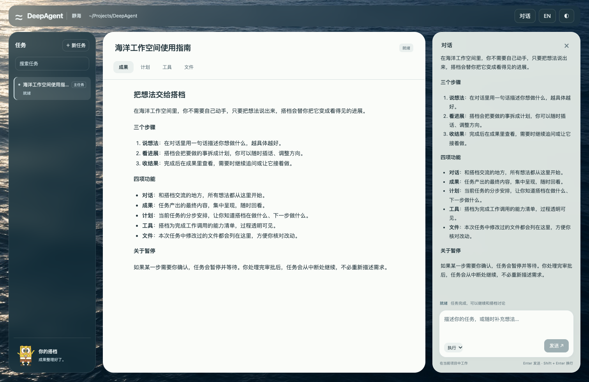

# 海洋界面验收 · 2026-10-11

实现：左侧任务树、中间成果／计划／工具／文件、右侧常驻对话，海面背景与海绵宝宝。没有新增前端框架；HTML、CSS、业务 JS 合计 **1319 → 1239 行**（不计测试与图片）。



截图来自本地真实 API 模型对话；为公开展示，将顶部个人目录文字替换成 `~/Projects/DeepAgent`。

## 实际服务与浏览器验收

使用 Chrome、独立 Web 和 Worker、MySQL 8、Redis。42 项浏览器验收检查通过，无页面脚本异常。模型桩确定工具调用顺序，工具、Graph、数据库及恢复流程均实际执行；另用本地配置的真实 API 模型完成对话。

| 范围 | 已验证行为 |
| --- | --- |
| 桌面布局 | 1512／1280／1024／900 像素宽度；输入区可见；中间切换不隐藏对话；键盘访问训练入口 |
| 对话 | 流式输出、刷新历史不重复、草稿保留、长回复折叠与展开、独立滚动、回到最新、收起与重开 |
| 连接与任务 | 断网重试与恢复、无效任务恢复且保留草稿、执行中追加输入；主子任务层级、搜索、返回主任务、关闭后隐藏输入 |
| 工具与文件 | 读写、编辑、搜索、列目录、删除、补丁、glob、rg、语义搜索、真实 Go 诊断；紧凑工具链接与详细记录、修改预览刷新、删除文件无失效链接、工具错误展示、真实 Shell 命令、跨 Run 后台命令与等待结果、非零退出与超时 |
| 审批 | 允许、拒绝、仅当前任务当前工具的始终允许；新工具和新任务重新询问；并行子代理逐项允许／拒绝，只有获准文件被写入 |
| 中断恢复 | 停止执行不显示成功成果；问题刷新后保留；真正重启 Worker 后由浏览器回答并恢复原 RunID |
| 扩展 | 计划步骤、Skills、MCP、网页读取与搜索、Graph 子代理、跨任务创建／等待／发消息／第二轮执行／关闭；真实 Chrome 打开／观察／输入／按键／点击／滚动／截图，过期观察和未授权地址被拒绝 |
| Docker | 真实容器中读写／编辑／查询／补丁／删除、命令与后台任务；挂载文件预览与宿主机内容一致，Worker 退出后容器被删除 |
| 历史与记忆 | 压缩记录实际写入 MySQL；重启 Worker 后模型收到摘要、界面仍保留原始对话；长期记忆经提取与整合写入 Redis，重启后的新任务收到记忆 |
| 本地模型 | 真正调用 MLX 推理；训练预览、修正副本、包含上一轮、确认、刷新、取消标记；中英与深浅主题持久化 |
| 完成状态 | 修复 Run 结束后 Worker 仍持有租约导致界面回退为“执行中”的问题；真实 API 对话后连续轮询仍保留成果 |

独立进程验收还验证了 Worker 退出与 checkpoint 恢复；浏览器用例也单独验证了进程重启续跑。

## 自动训练实机验收

为缩短等待，仅对临时验收二进制使用 Go overlay：门槛 10 条、空闲 10 秒。**生产代码仍是 100 条、10 分钟，且必须接电。**

- 浏览器确认 10 条样本；实际 MLX 自动微调完成，训练／验证／测试分区为 8／1／1。
- 验收运行 20 个训练步，生成 `adapters.safetensors`，大小 **2,889,527 字节**。
- 训练仍在运行时，API 对话成功结束。
- 状态为 `pending_validation`，未自动启用新参数；取消标记并刷新不删除已生成参数。
- 初版验收脚本的异步等待曾产生误判；最终改用 API 轮询和非空参数文件核验，上述结果来自复测。

## 检查与边界

```bash
go test -race -count=1 ./...
node --test deepagent/host/web/app.test.cjs
git diff --check
```

前端 59 项测试通过，Go 全仓竞态回归通过，macOS／Linux 编译通过；独立审查通过。远端 [CI 编译与全仓测试](https://github.com/doinglaundry/deepagent/actions/runs/38070801551) 全部通过，使用 `go.mod` 指定的 Go 1.25；Chrome 保持沙箱启用。详细记录见 [验收结果](ocean-ui-results.json)。

**Mac 桌面应用操作尚未完成实机验收**：系统拒绝辅助功能访问，已请求用户开启 `deepagent-computer` 权限。这一项不能标为通过。真实权限错误已在浏览器工具详情中验证；浏览器工具实机验收已通过。

验收额外修复了三处实际失败：Go 1.25 Linux 下上传目录读取漏文件，改为在受限根目录内直接查询文件；协作等待的查询耗尽自身时限时返回“等待中”，仍保留调用方取消和真实存储错误。以及浏览器过期时先移除记录、后关闭 Chrome 的清理竞态，改为 Chrome 完全退出后移除。三处都有回归验证，浏览器过期用例连续运行 10 次并通过竞态检查。

上述是按功能路径进行的端到端验收，不代表穷举所有配置组合；Mac 桌面权限是尚未完成的验收项。
